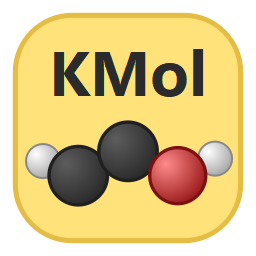
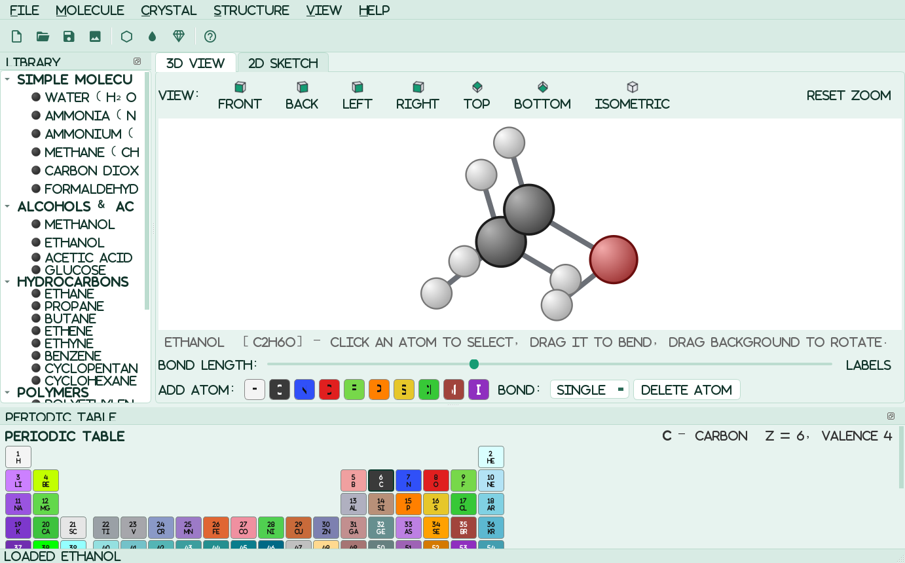

# KherveMol

**Draw chemical compounds and crystal structures in 2D and 3D.**

KherveMol is a native PyQt5 desktop app in the Kherve family. It pairs an
interactive **3D ball-and-stick** viewer/builder with a flat **2D skeletal
sketcher**, over one shared molecular model. There are no heavy chemistry
dependencies: the 3D view is drawn with **OpenGL** (shaded spheres and
cylinders, smooth edges) through PyQt5 alone — no PyOpenGL — and falls back to a
pure-Python vector renderer where OpenGL is unavailable. RDKit is optional.



## Features

- **OpenGL 3D viewer** — per-pixel lit spheres and cylinders with
  specular highlights, rim light, depth fog and 4× anti-aliasing; ball &
  stick, space-filling or sticks. Drag to orbit, wheel to zoom, snap to
  any face with the view cube. Thousands of atoms stay smooth.
- **Build molecules by hand** — click an atom, then click an element to
  bond a new atom on. The builder respects each element's valence and
  refuses to over-bond. Drag an atom to bend a bond.
- **700+ molecules, built without RDKit** — gases, acids, salts, oxides,
  VSEPR shapes, hydrocarbons, aromatics, biomolecules and the common
  medicines. A built-in SMILES parser and 3D embedder turns any SMILES
  into a 3D model (RDKit is used instead, when installed).
- **120+ crystals** — metals, semiconductors, salts, oxides, layered
  materials (fcc, bcc, hcp, diamond, zinc blende, wurtzite, rock salt,
  fluorite, rutile, perovskite, quartz, corundum, MoS₂…), any block of
  cells, with the cell outline and bonds.
- **Surfaces** — a slab of any crystal cut along any (hkl) plane:
  Si(111), rutile(110), Cu(100), GaN(10-10)…
- **Graphene, nanotubes & fullerenes** — graphene sheets (AA / AB / ABC,
  twisted bilayers, vacancies, doping), nanoribbons, quantum dots,
  graphite surfaces, (n,m) nanotubes and C20 / C60 / C70… cages.
- **Molecules on surfaces** — place the molecule you drew (or a SMILES) on any
  slab, flat or upright, at a chosen height.
- **Automatic updates** — KherveMol pulls new commits from GitHub by itself
  (clean checkouts only), shows what changed and offers to restart.
- **Polymers** — 40 presets (PE, PVC, PTFE, PMMA, nylon, PET, Kevlar,
  silicone…) or your own SMILES repeat unit, repeated n times.
- **Icon toolbars** — every library as a split button (builder + list) and
  every drawing tool (2D sketch, 3D atom / bond / delete, conversion,
  reaction film) one click away. Menus, toolbar and library tree list the
  same entries.
- **Reactions** — type `CH4 + O2 -> CO2 + H2O`; KherveMol balances atoms
  and charge and lays the balanced reaction out in 3D, with the molecules,
  coefficients, plus signs and arrow — then press **Animate** to watch the atoms
  rearrange, bonds breaking and forming. 36 classic reactions included.
- **2D structure sketcher** — proper skeletal formulae (line bonds,
  lettered heteroatoms, implicit H). Loading/building mirrors the 3D model
  into it automatically; **Build 3D from 2D sketch** (Ctrl+B) goes the other
  way. Right-click menus in both views.
- **Full periodic table** — all 118 elements, CPK-coloured, as a dockable
  picker; the active element can be bonded into the 3D structure (any
  element, not just a fixed palette).
- **Export SVG for KhervePaint** — molecules export to SVG that opens in
  [KhervePaint](https://github.com/gkerherve/KhervePaint) as editable,
  gradient-filled vector items.
- **Explorer** — one searchable browser of every molecule, crystal,
  surface, nanostructure and reaction, with a live 3D preview.
- **Properties** — formula and molecular weight for any molecule; with
  RDKit, exact mass, LogP, TPSA, H-bond donors/acceptors, rings, and
  InChI / InChIKey.
- **AI Chat** — ask chemistry questions or say "draw caffeine"; the
  assistant answers and renders the molecule. Works with Claude, ChatGPT,
  Mistral, Ollama or a local server; all network runs off the UI thread.
- **SMILES & file import (optional, via RDKit)** — type a SMILES string to
  embed a real 3D conformer, or open `.mol` / `.sdf` / `.pdb` files. Works
  headless, no Jupyter. `pip install rdkit` to enable.
- **`.kmol` save/open** and **PNG export**.
- Themeable UI shared with the rest of the Kherve family.

## Install & run

```bash
pip install -r requirements.txt
python KherveMol.py          # or: python -m khervemol
```

Requires Python 3.12+ with PyQt5 and qtawesome.

## Quick start

1. Pick a structure from the library tree on the left (molecules,
   crystals, surfaces, graphene & nanotubes, reactions), the **Crystal**
   or **Reaction** menus, or the **Explorer** (Ctrl+L).
2. In **3D View**, drag to rotate, use the wheel to zoom, and the view
   cube to snap to standard orientations.
3. To build: click an atom (green ring), pick a bond order, then click an
   element in the **Add atom** palette. Press **Delete** to remove an atom.
4. Switch to **2D Sketch** to draw a flat formula, or use
   **Structure ▸ Flatten 3D → 2D sketch**.
5. **File ▸ Save** writes a `.kmol`; **File ▸ Export PNG** writes an image
   of the current tab.

See the in-app **Help ▸ User Guide** (F1) or [USERGUIDE.md](USERGUIDE.md).

## License

GPL-3.0 © 2026 Gwilherm Kerherve
